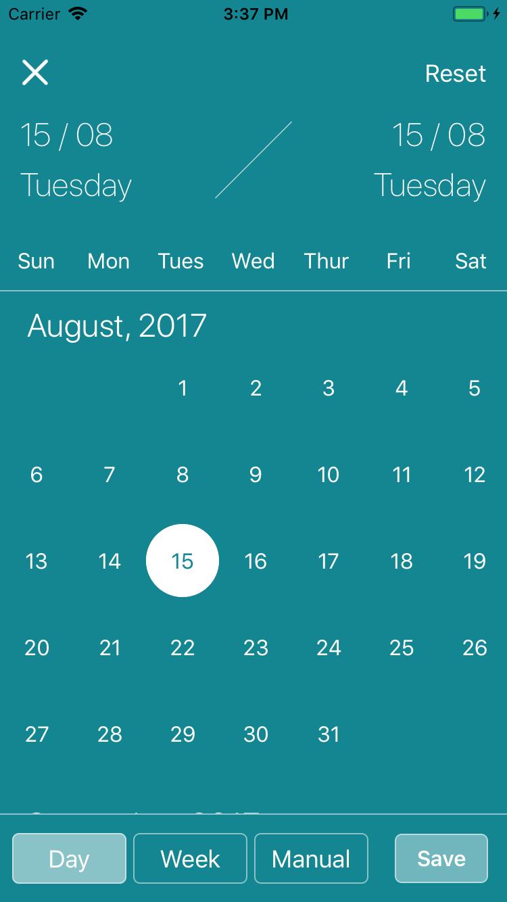
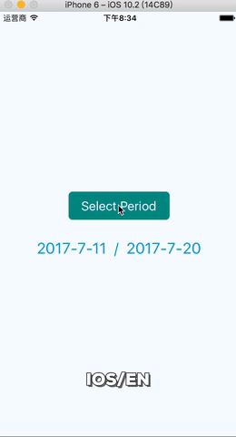
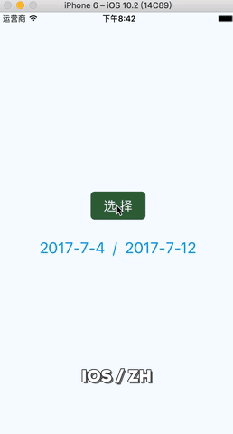
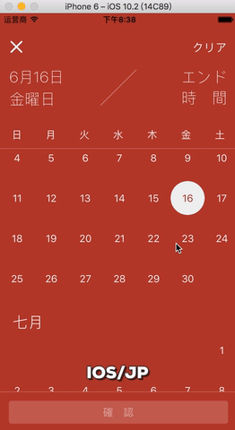
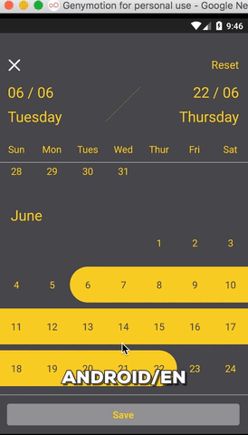
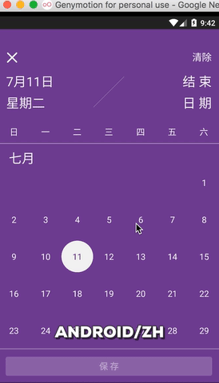
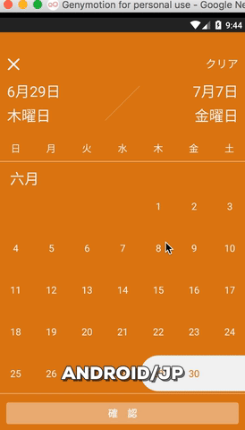

## react-native-calendar-select [](https://travis-ci.org/Tinysymphony/react-native-calendar-select) [](https://coveralls.io/github/Tinysymphony/react-native-calendar-select?branch=master)

A date picker component like Airbnb. You can select a date period from the calendar modal.

### Examples

#### Selection Types Example

<a href="#selectionType" id="selectionType"></a>

#### iOS Examples

<a href="#ios-en" id="ios-en"></a>

<a href="#ios-zh" id="ios-zh"></a>

<a href="#ios-jp" id="ios-jp"></a>

#### Android Examples

<a href="#a-en" id="a-en"></a>

<a href="#a-zh" id="a-zh"></a>

<a href="#a-jp" id="a-jp"></a>

### Usage

> This component use `moment.js` to process date.

**install from npm**

```shell
npm install --save react-native-calendar-select
```

**import in project**

```js
import Calendar from "react-native-calendar-select"
```

```js
constructor (props) {
  super(props);
  this.state = {
    startDate: new Date(2017, 6, 12),  
    endDate: new Date(2017, 8, 2)
  };
  this.confirmDate = this.confirmDate.bind(this);
  this.openCalendar = this.openCalendar.bind(this);
}
// when confirm button is clicked, an object is conveyed to outer component
// contains following property:
// startDate [Date Object], endDate [Date Object]
// startMoment [Moment Object], endMoment [Moment Object]
confirmDate({startDate, endDate, startMoment, endMoment}) {
  this.setState({
    startDate,
    endDate
  });
}
openCalendar() {
  this.calendar && this.calendar.open();
}
// in render function
render() {
  // It's an optional property, I use this to show the structure of customI18n object.
  let customI18n = {
    'w': ['', 'Mon', 'Tues', 'Wed', 'Thur', 'Fri', 'Sat', 'Sun'],
    'weekday': ['', 'Monday', 'Tuesday', 'Wednesday', 'Thursday', 'Friday', 'Saturday', 'Sunday'],
    'text': {
      'start': 'Check in',
      'end': 'Check out',
      'date': 'Date',
      'save': 'Confirm',
      'clear': 'Reset'
    },
    'date': 'DD / MM'  // date format
  };
  // optional property, too.
  let color = {
    subColor: '#f0f0f0',
    mainColor: "#f4995d"
  };
  return (
    <View>
      <Button title="Open Calendar" onPress={this.openCalendar}>
      <Calendar
        i18n="en"
        ref={(calendar) => {this.calendar = calendar;}}
        customI18n={customI18n}
        color={color}
        format="YYYYMMDD"
        minDate="20170510"
        maxDate="20180312"
        startDate={this.state.startDate}
        endDate={this.state.endDate}
        onConfirm={this.confirmDate}
      />
    </View>
  );
}
```

### Properties

| Property      | Type                          | Default      | Description                                                                                                                                                         |
| ------------- | ----------------------------- | ------------ | ------------------------------------------------------------------------------------------------------------------------------------------------------------------- |
| i18n          | String                        | 'en'         | Language of the component, supports `en` / `zh` / `jp`.                                                                                                             |
| customI18n    | Object                        | {}           | Customize text of the component, the structure of this object is shown in the example above.                                                                        |
| color         | Object                        | {}           | Customize color.                                                                                                                                                    |
| format        | string                        | 'YYYY-MM-DD' | Define date format, you can also pass Date Object or Moment Object as props.                                                                                        |
| minDate       | String / Object               | -            | Min date of calendar                                                                                                                                                |
| maxDate       | String / Object               | -            | Max date of calendar                                                                                                                                                |
| startDate     | String / Object               | null         | Start date of selection                                                                                                                                             |
| endDate       | String / Object               | null         | End date of selection                                                                                                                                               |
| onConfirm     | Function                      | -            | Callback function when the period is confirmed, receives an object as only parameter, contains `startDate` / `endDate` / `startMoment` / `endMoment` four property. |
| selectionType | enum(`manual`, `week`, `day`) | "manual"     | Initial (optional) selection type can be one of `manual`, `week` and `day`                                                                                          |
| animationType | enum(`slide`, `fade`, `none`) | "slide"      | Initial (optional) animation type can be one of `slide`, `fade` and `none`                                                                                          |

### Instance methods

| Method  | Description                                  |
| ------- | -------------------------------------------- |
| cancel  | Cancel modification of state and close modal |
| close   | Close select modal                           |
| open    | Open select modal                            |
| clear   | Reset state of component                     |
| confirm | Confirm selection and close modal            |

### Color properties

| Prop        | Description                               |
| ----------- | ----------------------------------------- |
| subColor    | Sets the Text Color                       |
| mainColor   | Sets the Background Color of the Calendar |
| borderColor | Sets the Color of the Calendar border     |

LICENSE MIT
